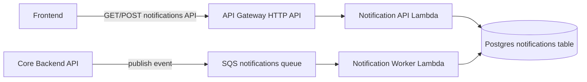

# Notifications Microservice Guide

This document explains the new notifications microservice implemented with:

- Core backend event publisher
- Amazon SQS queue
- AWS Lambda notification worker
- AWS Lambda notification API behind API Gateway

It is intended as the operational guide for teammates (setup, deploy, test, and troubleshoot).

## 1) Architecture Overview



## 2) Event Flow

1. User action happens in core backend (answer/comment/accept).
2. Backend publishes a notification event to SQS.
3. Worker Lambda consumes the event and writes to `notifications`.
4. Frontend fetches unread count/list from notification API.
5. Frontend marks notifications read via notification API.

## 3) Event Contract

Event payload fields:

- `event_id` (UUID)
- `event_type` (`ANSWER`, `COMMENT`, `ACCEPTED`)
- `event_version` (currently `1`)
- `occurred_at` (ISO-8601 timestamp)
- `recipient_id` (UUID)
- `reference_id` (UUID)
- `message` (string)
- `recipient_email` (optional)
- `send_email` (optional, boolean)

See also: `docs/notifications-microservice-contract.md`.

## 4) API Contract

Base URL: `VITE_NOTIFICATION_API_URL`

- `GET /notifications?unread_only={bool}&page={int}&size={int}`
- `GET /notifications/unread-count`
- `POST /notifications/read`
  - Body: `{ "notification_ids": ["<uuid>", "..."] }`

Auth:
- `Authorization: Bearer <Cognito access token>`

## 5) Database Requirements

`notifications` table must include:

- `source_event_id` (nullable, unique index for idempotency)
- `delivery_source` (`direct` or `sqs`)

Apply migration before verification:

```bash
docker compose exec backend alembic upgrade head
```

## 6) Required Environment Variables

### Backend (`backend/.env`)

- `SQS_NOTIFICATION_QUEUE_URL`
- `NOTIFICATION_DELIVERY_MODE` (`sqs` recommended for microservice path)
- `AWS_REGION`

### Frontend (`frontend/.env`)

- `VITE_NOTIFICATION_API_URL`
- `VITE_API_URL`
- Cognito vars (`VITE_COGNITO_*`)

### Notification Lambdas (Terraform-managed)

- DB credentials (`DB_HOST`, `DB_PORT`, `DB_NAME`, `DB_USER`, `DB_PASSWORD`)
- Cognito values for notification API Lambda

## 7) Deploy Checklist

1. Build and push worker image (`lambda/notification_worker`).
2. Build and push notification API image (`lambda/notification_api`).
3. Ensure Terraform vars are populated (`notification_*` values).
4. Apply notification module:
   - `terraform apply "-target=module.notification_service"`
5. Update backend and frontend env values.
6. Restart local stack:
   - `docker compose down && docker compose up -d --build`

## 8) Verification Checklist

- CORS test:
  - `GET /notifications/unread-count` returns `200` in browser network tab.
- Queue processing:
  - SQS shows `ApproximateNumberOfMessages = 0` and `NotVisible = 0` after processing.
- Worker lambda:
  - Invocations increase; no errors.
- DB:
  - New row appears with `delivery_source = 'sqs'`.
- UI:
  - Bell shows unread count and list.

## 9) Common Issues and Fixes

### CORS errors on unread count/list
- Ensure API Gateway HTTP API has `cors_configuration` allowing `http://localhost:5173`.

### Lambda image media type not supported
- Rebuild with Lambda-compatible format:
  - `docker buildx build --platform linux/amd64 --provenance=false --sbom=false --load ...`

### SQS event source mapping creation fails
- Ensure queue visibility timeout is greater than or equal to worker Lambda timeout.

### Messages stuck invisible / repeated invocation
- Check worker Lambda logs and DB schema migration.
- Confirm `source_event_id` and `delivery_source` columns exist.

### Large Terraform plan touching existing infra
- Keep existing stack region unchanged.
- Use notification-specific provider alias region and targeted apply for notification module.

## 10) Operational Notes

- Current deployment intentionally uses `-target` for safe incremental rollout.
- Run full-stack Terraform reconciliation only in a separate cleanup window.
- Keep this feature isolated to avoid unintended drift in existing ALB/EC2/S3 resources.
